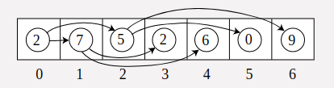
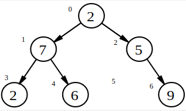

# A Tree in an Array

To store a Binary Tree in an Array, we just need to determine the order that we store the Nodes in. A good order is "**breadth-first**" where we  store the items in order top-down and left-to-right of the tree.

Here's a tree represented as an array:

And this is the tree _unfolded_:

Notice that `5` only has one child Node, so the other child is represented as `0` in the above array. This is OK as long as we don't need to store  actual `0` values.

## Challenge

The input for this challenge will provide an array of numbers in the above **breadth-first** format, and use `0`'s for non-nodes. Can you print out the sum of the Leftmost side of the Tree?

Tip: A number located at position i in an array will have it's left child located at the position 2i+1 in the array. 

**Solution**: I am using a queue instead to populate the tree in a breadth first manner. In the breadthwise serialization, 2n - 1 values are stored in the array for each level `n` of the tree. The `nil` nodes are all represented by `0`s in the array.

**Note**: Here the `nil` nodes are also completely represented, in that their `left` and `right` children are recorded as `0`s in the serialized array.

### Test case example:

    leftmost_nodes_sum([2, 7, 5, 2, 6, 0, 9])
    # => 11

Go down the left-hand side of the tree to get the sum: `2+7+2 = 11`. You can take a look at the image of the tree above.

## Creating a Tree

To implement a Tree, we'll create a Node class. It will store an integer of Data, and point to 2 child Nodes. 

    class Node
        attr_reader :data
        attr_accessor :left, :right

        def initialize(data)
            @data = data
        end
    end

The following code shows a recursive algorithm to create a tree data structure, given an array, and the position of the node in the array. The logic used is, for a node in the ith position in the array, it's `left` child is at the `2i + 1` position, and the `right` child is at the `2i + 2` position. Also, the array elements with value `0` are nil elements. I have, however, used a queue and a loop to create the desrialize the tree from the given array. 

    def array_to_tree(array, i)
        return nil if i >= array.length || array[i] == 0

        node = Node.new(array[i])
        node.left = array_to_tree(array, 2*i+1)
        node.right = array_to_tree(array, 2*i+2)

        node
    end

**Note**: Also from my source code, the above bit seems to be missing logic for `nil` elements, whose children are also recorded as `nil` elements in the array. So it can't be used without that correction.

## Traversing a Tree in Pre-order

Pre-order traversal means you process a Node and then process its sub-trees. 

    def pre_order(node)
        if node == nil
            return ''
        end
        # Process node data
        # call pre_order(node.left)
        # call pre_order(node.right)
    end
 
## Challenge

You will be given an array as input, which represents a Tree. Process the array into a Tree of Nodes. Then go through the tree and print it in post-order. Print each number space-separated.

### Example test case

    tree = array_to_tree([10, 1, 2, 3, 4, 5, 6])

    puts post_order(tree)
    #=> 3 4 1 5 6 2 10