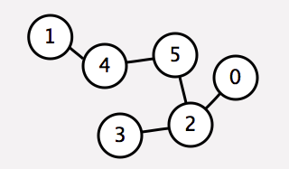

# Graphs

## Representing a Graph

A Node in a real-world graph represents something unique, such as a city on a map, or a person in a network. When studying graphs, the nodes can just be labeled with a unique number starting from 0, so they're easy to work with.

There are many ways to represent a graph in a computer. A good structure should balance using space efficiently and performing operations quickly. As seen with Trees, you could represent the data with individual Nodes. However, this wouldn't let you quickly access any Node in the graph. A good alternative is to create an array or list to represent all the nodes. Each cell in the list can then store a list of all the Nodes that are connected to that Node.

For example, the above graph can be represented as shown below:

index | list of connected nodes
------|------
0    | 2
1    | 4
2    | 5, 0, 3
3    | 2
4    | 1, 5
5    | 4, 2

This shows the connections between nodes `0` and `2`, nodes `1` and `4`, etc.

## Challenge

You will be given lists of numbers as input based on the above format. Then start from Node `0` and repeatedly visit the next connected node until you reach Node `4`. You need to return an array with all the nodes visited.

While Nodes don't necessarily have a set order for their connections, in this challenge you should go to the _first_ Node in the list of input. For example, in the above graph, go from `0` to `2` to `5` to `4` and then stop.

## Example

    hash = {
    0 => [2], 
    1 => [4], 
    2 => [5, 0, 3], 
    3 => [2], 
    4 => [1, 5], 
    5 => [4, 2]
    }

    p graph(hash)
    # => [0, 2, 5, 4]

The test cases for the above program require us to visit the first node, in the list of connections to each node, recursively in order to determine the path.